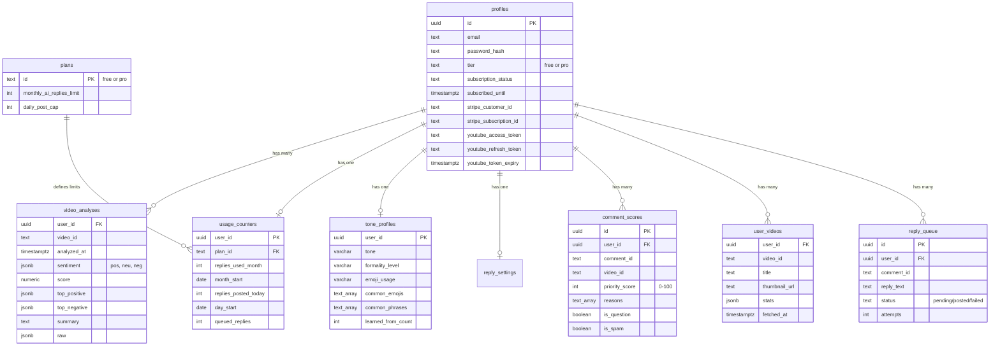

# Vocalytics Architecture Diagrams

**Visual representation of system architecture using Mermaid**

---

## Table of Contents

1. [High-Level System Architecture](#1-high-level-system-architecture)
2. [Detailed Application Architecture](#2-detailed-application-architecture)
3. [Authentication Flow](#3-authentication-flow)
4. [Video Analysis Flow](#4-video-analysis-flow)
5. [Payment Flow](#5-payment-flow)
6. [Database Schema](#6-database-schema)
7. [Technology Stack](#7-technology-stack)

---

## 1. High-Level System Architecture


---

## 2. Detailed Application Architecture


---

## 3. Authentication Flow


---

## 4. Video Analysis Flow


---

## 5. Payment Flow


---

## 6. Database Schema



---

## 7. Technology Stack


---

## 8. Request/Response Flow - Complete Lifecycle


---

## 9. Background Jobs Architecture

```mermaid
graph LR
    subgraph "Vercel Cron"
        Schedule1[Every 5 minutes]
        Schedule2[Daily at 8:10 AM]
    end

    subgraph "Workers"
        QueueWorker[queueWorker.ts<br/>Process pending replies]
        ResetWorker[resetCounters.ts<br/>Reset usage counters]
    end

    subgraph "Database Operations"
        FetchQueue[SELECT * FROM reply_queue<br/>WHERE status = 'pending']
        UpdateQueue[UPDATE reply_queue<br/>SET status = 'posted']
        ResetCounters[UPDATE usage_counters<br/>SET analyze_weekly_count = 0]
        RollPeriods[CALL roll_usage_counters()]
    end

    subgraph "External Actions"
        PostToYT[POST /youtube/comments<br/>commentThreads.insert]
    end

    Schedule1 -->|Trigger| QueueWorker
    Schedule2 -->|Trigger| ResetWorker

    QueueWorker --> FetchQueue
    FetchQueue --> QueueWorker
    QueueWorker -->|For each| PostToYT
    PostToYT -->|Success| UpdateQueue
    PostToYT -->|Failure| UpdateQueue

    ResetWorker --> RollPeriods
    RollPeriods --> ResetCounters

    style Schedule1 fill:#f39c12
    style Schedule2 fill:#f39c12
    style PostToYT fill:#ff0000
```

---

## 10. Error Handling Flow


---

## Notes for Technical Interviews

### Key Talking Points

**1. Architecture Pattern:**
- Client-server with serverless backend
- Three-layer backend (routes → services → database)
- RESTful API design
- Event-driven (webhooks)

**2. Scalability:**
- Serverless auto-scales (0 to 10,000+ requests/sec)
- Database connection pooling via Supabase
- Caching: React Query (frontend), video analyses (backend)
- Stateless backend (no server-side sessions)

**3. Security:**
- JWT tokens in HTTP-only cookies (prevents XSS)
- bcrypt password hashing (10 rounds)
- Row-Level Security (RLS) in database
- Rate limiting on all endpoints
- Input validation with Zod schemas
- CORS restrictions

**4. Performance:**
- Code splitting with Vite
- React Query caching (5-minute default)
- Database indexes on all foreign keys
- Aggressive caching of expensive operations (AI analysis)
- Pagination on large datasets (100 items/page)

**5. Reliability:**
- Webhook idempotency (stripe_events table)
- Graceful degradation (OpenAI fallback)
- Error boundaries in React
- Comprehensive test coverage (2:1 ratio)
- Database backups (daily)

**6. Cost Optimization:**
- Serverless = pay per request (no idle costs)
- Cache AI results (never re-analyze)
- Batch OpenAI requests when possible
- Free tier for YouTube API (10k quota/day)
- ~$0.01-0.03 per user per month at scale

**7. Trade-offs Made:**
- Serverless (scalability) vs Containers (control)
- Supabase (speed) vs Self-hosted PostgreSQL (flexibility)
- OpenAI (quality) vs Open-source models (cost)
- Monorepo (shared code) vs Separate repos (isolation)
- Heavy use of third-party services (speed to market) vs Building in-house (more control)

---

**Created:** November 21, 2025
**For:** Technical interviews, architecture reviews, team onboarding
**Maintained By:** Engineering team
